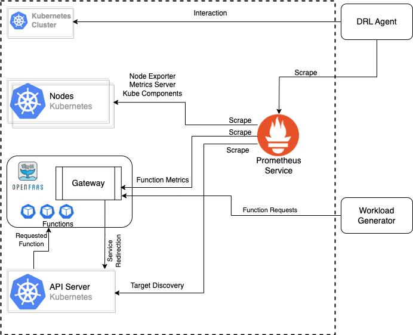

# DRe-SCale
__DRe-SCale__: A *D*eep *Re*current *Re*inforcement Learning Method for Intelligent Auto*Sc*aling of Serverless Functions

### Abstract  
Function-as-a-Service (FaaS) introduces a lightweight, function-based cloud execution model that finds its relevance in a range of applications like IoT-edge data processing and anomaly detection. While cloud service providers (CSPs) offer a near-infinite function elasticity, these applications often experience fluctuating workloads and stricter performance constraints. A typical CSP strategy is to empirically determine and adjust desired function instances or resources, known as __*autoscaling*__, based on monitoring-based thresholds such as CPU or memory, to cope with demand and performance. However, threshold configuration either requires expert knowledge, historical data or a complete view of the environment, making autoscaling a performance bottleneck that lacks an adaptable solution. Reinforcement learning (RL) algorithms are proven to be beneficial in analysing complex cloud environments and result in an adaptable policy that maximizes the expected objectives. Most realistic cloud environments usually involve operational interference and have limited visibility, making them partially observable. A general solution to tackle observability in highly dynamic settings is to integrate Recurrent units with model-free RL algorithms and model a decision process as a __Partially Observable Markov Decision Process__ (POMDP). Therefore, in this paper, we investigate the model-free Recurrent RL agents for function autoscaling and compare them against the model-free Proximal Policy Optimisation (PPO) algorithm. We explore the integration of a *Long-Short Term Memory* (LSTM) network with the state-of-the-art PPO algorithm to find that under our experimental and evaluation settings, recurrent policies were able to capture the environment parameters and show promising results for function autoscaling. We further compare a PPO-based autoscaling agent with commercially used threshold-based function autoscaling and posit that a LSTM-based autoscaling agent is able to improve throughput by 18%, function execution by 13% and account for 8.4% more function instances.

---
### System Setup and Architecture  
We set up our experimental multi-node cluster using NeCTAR (Australian National Research Cloud Infrastructure) services on the *Melbourne Research Cloud*. It includes a combination of 2 nodes with `12/48`, 1 node with `16/64`, 1 node with `8/32` and 1 node with `4/16` vCPU/GB-RAM configurations. We deploy *OpenFaaS* along with Prometheus service on MicroK8s (`v1.27.2`), however, we used Gateway `v0.26.3 `due to scaling limitations in the latest version and remove its alert manager component to disable rps-based scaling.

(For best resolution, kindly use Github's `White Theme`)

---

### LSTM-PPO based AutoScaling Solution
The core component of the proposed autoscaling solution is the integration of recurrent units with a fully-connected __multi-layer perceptron__ (MLP) that takes into environment observation and maintains a hidden internal state to retain relevant information. The LSTM layer is incorporated into both __actor__ and __critic__ networks to retain information i.e., the output of the LSTM layer is fed into fully-connected MLP layers, where the actor (policy network) is responsible for learning an action selection policy and the critic network serves as a guiding measure to improve actor's decision. The network parameters are updated as per PPO clipped surrogate objective function which helps the agent balance its degree of exploration and knowledge exploitation. It further improves network sample efficiency and conserves large policy updates. 

(For best resolution, kindly use Github's `White Theme`)

---

### Scaling Agents Explored 
1.  [LSTM integrated Proximal Policy Optimisation](./scaling-agents/LSTM-PPO/) (LSTM-PPO/Recurrent-PPO)
2.  [vanilla Proximal Policy Optimisation](./scaling-agents/PPO/) (PPO)
3.  [Deep Recurrent Q-Network](./scaling-agents/DRQN/) (LSTM integrated DQN/DRQN)
4.  [LSTM integrated Soft-Actor-Critic](./scaling-agents/SAC(+LSTM)) (LSTM-SAC and SAC)

### Training and Evaluation
1.  [Experimental Results](/experimental-results/images/)
2.  [Analysis File](./experimental-results/analysisUtility.ipynb)
